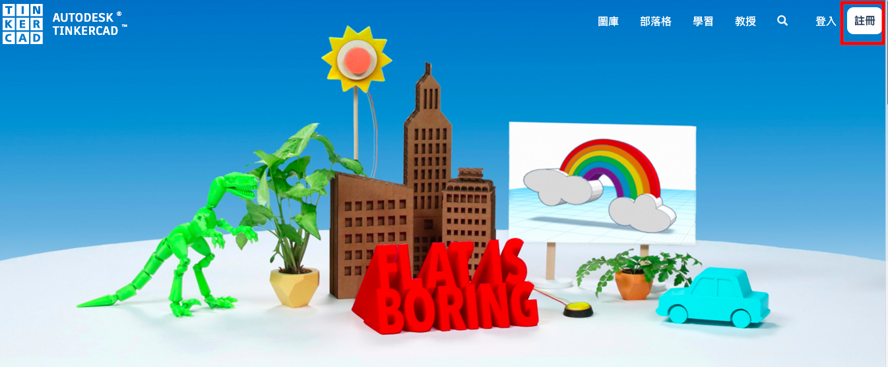
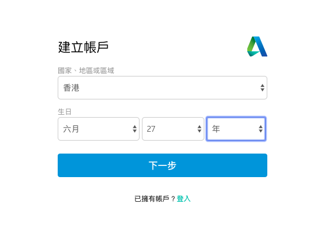
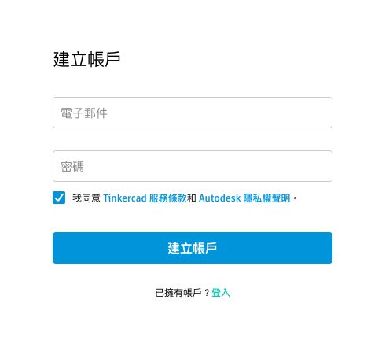
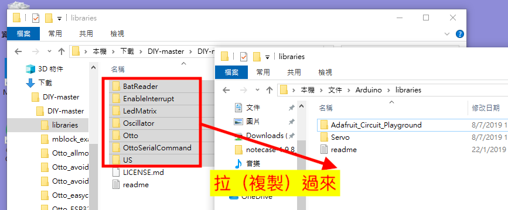
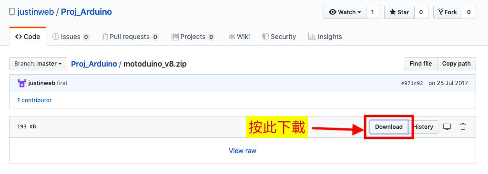

# ottoDIY_IR
Yet another otto DIY robot.  With IR remote control

## 3D打印編 
### 3D繪圖軟體
- Tinkercad網址：https://www.tinkercad.com
#### 註冊Tinkercad帳號  

連上網站後可以看到右上角有SIGN IN和SIGN UP兩個選項，按下SIGN UP來註冊新帳號。  
  
選擇地區和生日。  
   
填上電郵地址及密碼  
   
註冊完後系統就會自動轉至編輯頁面，而畫面上則出現第一個互動教學，使用者可按照底下方框內的文字說明進行操作。  
  
### 切片軟體
#### CURA

### 创想三维3D打印机教程：CR-100操作及打印视频  https://www.bilibili.com/video/av48710553/

### 先介紹什麼是「創客」，2015.10.17【民視異言堂】MAKER 自造者https://youtu.be/aDMZSVY2O4k

 
## 代碼編
### 環境準備
- 安裝Arduino IDE程式，下載網址：https://www.arduino.cc/en/Main/Software  
  

## Arduino 學習 http://coopermaa2nd.blogspot.com  
  
  
  
  

- 下載OTTO的相關程式，下載網址：https://github.com/OttoDIY/DIY   
  

- 將上面下載的壓縮檔解壓，並將解壓後libraries下的資料夾複製到 arduino的libraries的資料夾下

- 再來下載 motoBlockly的函式庫(libraries)，這是為了要讓紅外線遙控器可以用！下載網址：https://github.com/justinweb/Proj_Arduino/blob/master/motoduino_v8.zip  

- 下載後將motoduino_v8.zip解壓縮，並將整個motoduino_v8的資料夾複製到arduino/libraries下！
- **環境建置完成
