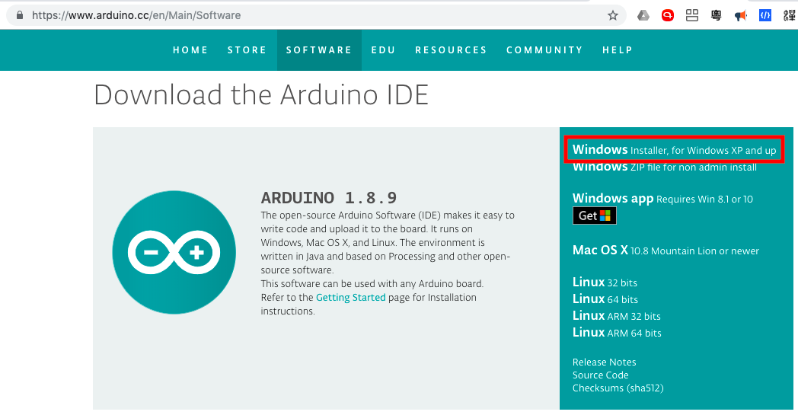
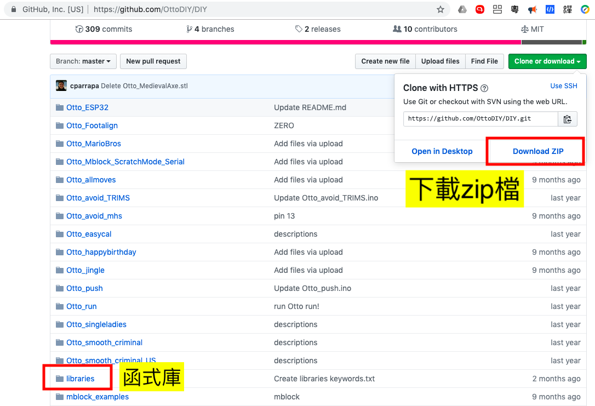

# ottoDIY_IR
Yet another otto DIY robot.  With IR remote control

# 一、環境準備
- 安裝Arduino IDE程式，下載網址：https://www.arduino.cc/en/Main/Software  
  

- 下載OTTO的相關程式，下載網址：https://github.com/OttoDIY/DIY   
  

- 將上面下載的壓縮檔解壓，並將解壓後libraries下的資料夾複製到 arduino的libraries的資料夾下

